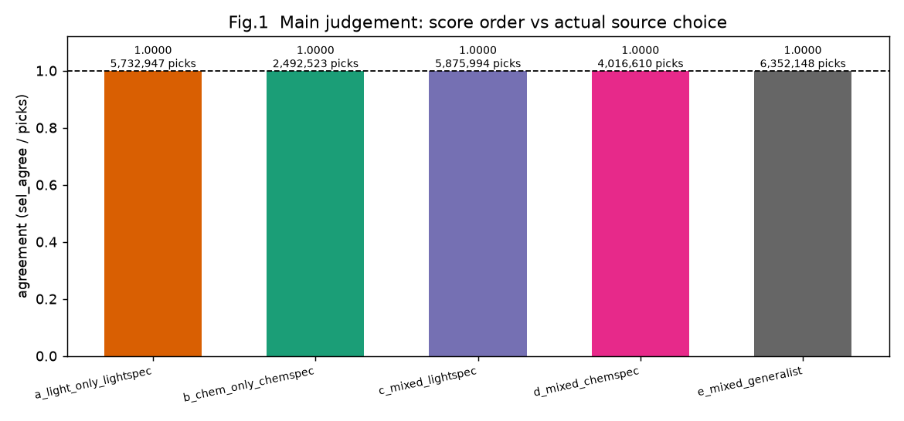
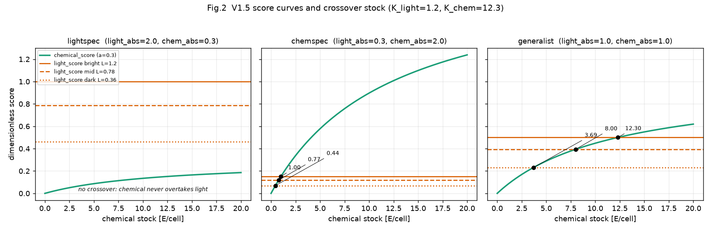
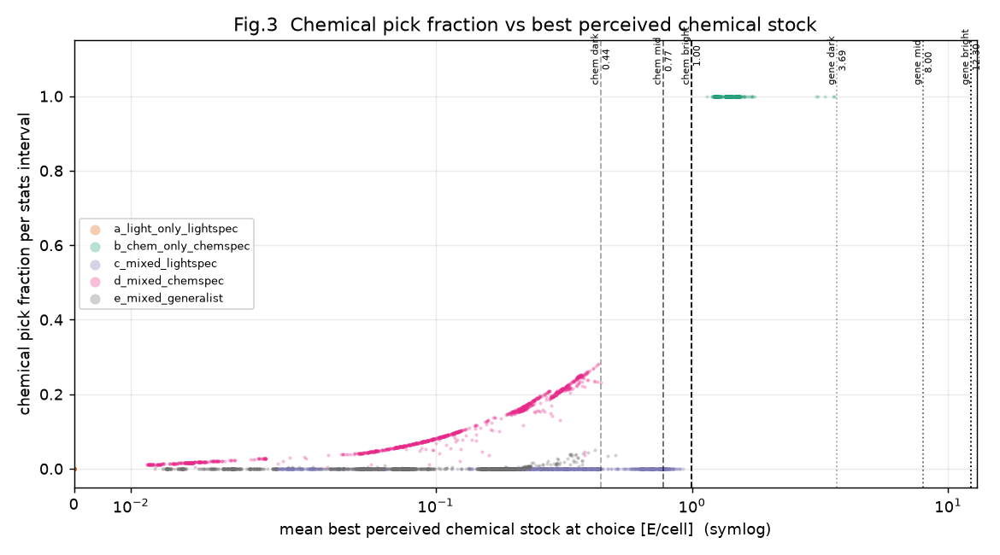
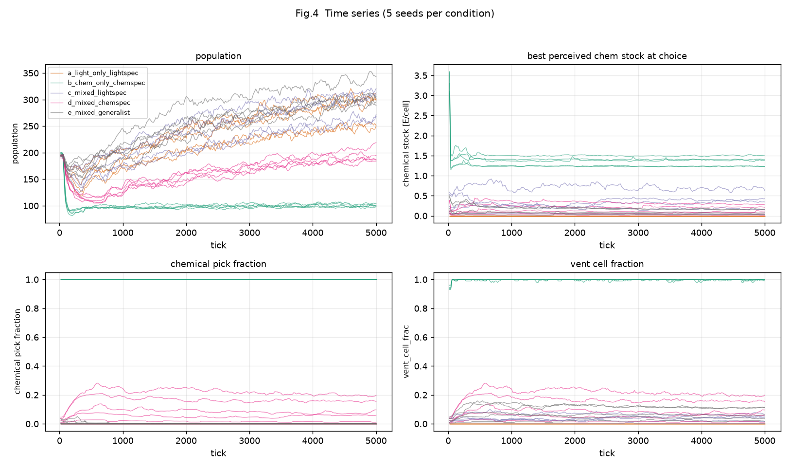
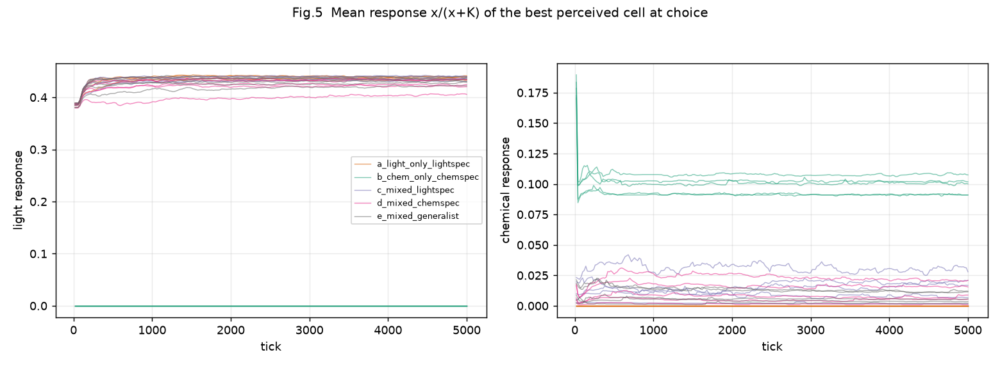
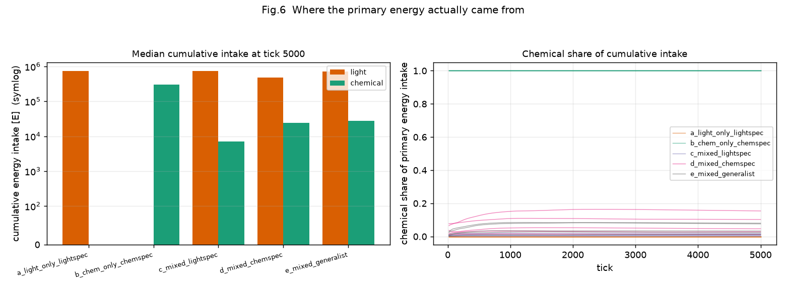
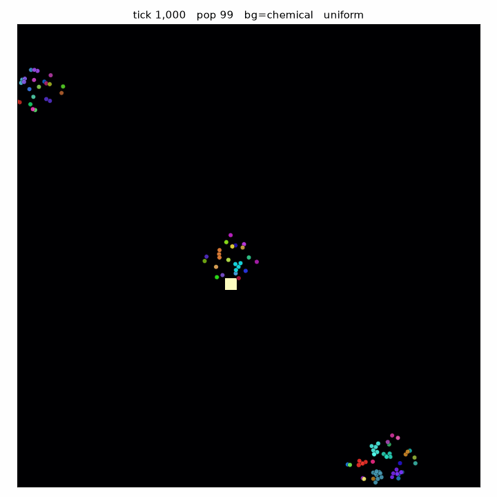
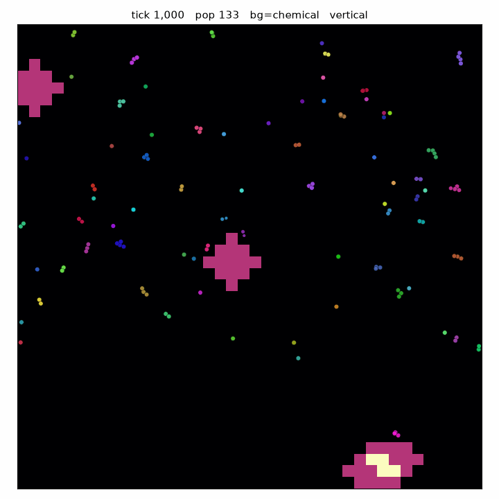
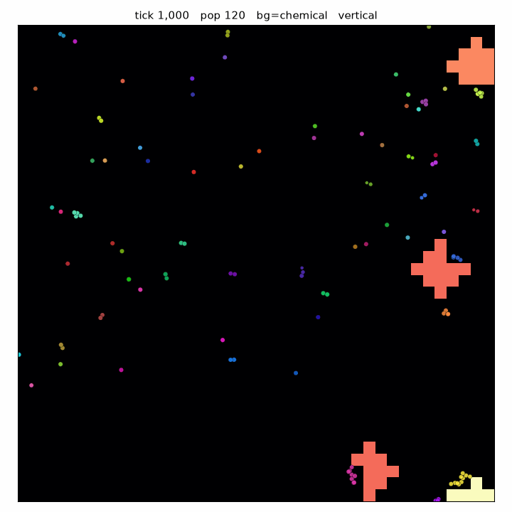

# Exp09 結果考察 — V1.5 異種一次Energy刺激比較則の診断

更新: 2026-08-31
状態: **実測完了 / Green**

正本:
- 実測値: `experiments/exp09_actions_20260831_085922/NOTES.md`
- 事前登録: `docs/Exp09_実験計画.md`
- 世界ルール: `docs/V1.5_異種刺激比較仕様.md`
- 前段: `docs/V1.4_総括.md`

## 1. 目的

V1.5で導入した

> 光とchemicalを無次元受容器応答へ変換して比較する行動則

が、事前登録した式どおりに働くかを確かめる。

Exp09は**光とchemicalの進化競争を評価する実験ではない**。
「どちらが強いか」ではなく「比較メカニズムが仕様どおりか」を見る。

## 2. 用語

初出の用語をここで定義する（`docs/実験結果保存方針.md` §5）。

- **無次元受容器応答** `response(x, K) = x / (x + K)`
  単位の違う刺激（光量 [E/tick] とchemical stock [E/cell]）を、
  0以上1未満の共通尺度へ変換した値。
- **`light_stimulus_half`（光刺激の半飽和光量）**
  光の応答が0.5になる光量。V1.5 defaultは1.2。
- **`chemical_stimulus_half`（chemical刺激の半飽和stock）**
  chemicalの応答が0.5になるstock。V1.5 defaultは12.3。
  典型的な完全13セルventの生物不在平衡stockを基準にした固定値。
- **交差点stock**
  ある光量と個体能力の組合せで `light_score` と `chemical_score` が等しくなる
  chemical stock。これより上ならchemical、下ならlightが優勢になる。
- **`light_uptake_coef`（光吸収速度係数）**
  個体の光利用能力を1 tickあたりの最大変換速度へ直す世界側の係数。V1.4で2.0に確定。
- **`chem_vent_flux`（1つのchemical噴出口が1 tickに供給するEnergy量）**
  V1.4で16.0 E/tick/ventに確定。
- **specialist（専門型）/ generalist（両用型）**
  片方の能力だけを高く固定した診断個体 / 両方を同程度に固定した診断個体。

事前登録した式:

```text
light_score    = light_absorption    × response(light,       1.2)
chemical_score = chemical_absorption × response(chem_stock, 12.3)
```

吸収量そのものはV1.4の吸収式を変更していない。V1.5が変えたのは
**どちらの一次Energy源へ向かうかの候補選択だけ**である。

## 3. 条件

5条件 × seed1-5 × 5,000 tick = 25 run。世界パラメータはV1.4恒久defaultのまま。

| 条件 | 光 | chemical | 診断表現型 (light_absorption / chemical_absorption) |
|---|---|---|---|
| a_light_only_lightspec | vertical | source 0 | lightspec 2.0 / 0.3 |
| b_chem_only_chemspec | 0 | flux 16 | chemspec 0.3 / 2.0 |
| c_mixed_lightspec | vertical | flux 16 | lightspec 2.0 / 0.3 |
| d_mixed_chemspec | vertical | flux 16 | chemspec 0.3 / 2.0 |
| e_mixed_generalist | vertical | flux 16 | generalist 1.0 / 1.0 |

両能力とも全世代で固定（`fixed_genes`）。進化効果を混ぜず、行動則だけを見る。
混合3条件は初期配置も`random`で揃え、chemical-only controlのみvent上に配置する。

## 4. 健全性チェック

- 25 runすべて同一数値実行環境・同一commit `c73b039`
- 早期終了run なし（全runが5,000 tick完走）
- 固定遺伝子は全期間で分散0
- 診断条件チェック 415項目すべてOK
- source排他成立（light-onlyでchemical flow=0、chemical-onlyで光供給=0）

前段のPhase 0（算術・選択則の決定論テスト）は `tools/bench_exp09.py` 31項目Green。
単独source Configが `v1.4-final` と完全一致することは
`tools/verify_vs_ref.py --single-source` の4ケースすべてで確認した。
**V1.5の観測追加と比較則は、単独source世界の結果を1 bitも変えていない。**

## 5. 主結果

### 5.1 主判定 — score順位と実際の選択は全区間で一致



| 条件 | 一致 | 選択回数 | 一致率 |
|---|---:|---:|---:|
| a_light_only_lightspec | 5,732,947 | 5,732,947 | **1.0000** |
| b_chem_only_chemspec | 2,492,523 | 2,492,523 | **1.0000** |
| c_mixed_lightspec | 5,875,994 | 5,875,994 | **1.0000** |
| d_mixed_chemspec | 4,016,610 | 4,016,610 | **1.0000** |
| e_mixed_generalist | 6,352,148 | 6,352,148 | **1.0000** |

計 **24,470,222回** の一次Energy候補選択すべてで、無次元scoreの順位と
実際に選ばれたsourceが一致した。事前登録した停止条件
「交差点の理論順位と選択結果が一致しない」には該当しない。

`stimulus_tie_eps=1e-9` 内の同点（tie）は全条件で0件だった。
40×40セルの連続場では厳密同点がまず起きないという想定と整合する。

#### この指標が示すこと / 示さないこと

一致率は `sel_agree == sel_light + sel_chemical` で測っている。
`sel_agree` は**無次元score比較の分岐を通って選択が決まった回数**、
`sel_light + sel_chemical` は**分岐を問わない全選択回数**である。

したがってこの1.0000が示すのは:

- 2,447万回すべてがV1.5の比較則を経由して決まった
- 単独source用のfallback分岐へ落ちた選択が1件も無い
- tieで方向付けを放棄した選択が1件も無い
- 観測に欠測区間が無い

示さないのは:

- **無次元score比較そのものが交差点式と代数的に等価であること**

後者は実runでは検証できない（実runの選択は定義上scoreに従う）。
交差点式との等価性、および交差点の両側を跨いだときに選択が実際に反転することは、
Phase 0の決定論テスト `tools/bench_exp09.py` 31項目で個別に検証している
（計画 §5 の項目7〜9）。実runが担うのは、その検証済みの経路が
**実際の世界で例外なく使われたか**の確認である。

集団水準での交差点式の予測力は §5.3（Fig.3）で別に見る。

### 5.2 交差点stockの構造



| 表現型 | 明部 L=1.2 | 中間 L=0.78 | 暗部 L=0.36 |
|---|---:|---:|---:|
| lightspec | 交差点なし | 交差点なし | 交差点なし |
| chemspec | 1.00 | 0.77 | 0.44 |
| generalist | 12.30 | 8.00 | 3.69 |

lightspecに交差点が無いのは実装の欠陥ではなく式の帰結である。
`(light_absorption / chemical_absorption) × response(L, 1.2)` が1以上になると、
chemical側は `chemical_absorption` を上限とするのでlightへ追いつけない。
lightspecでは明部で `2.0/0.3 × 0.50 = 3.33`、暗部でも `6.67 × 0.23 = 1.54` であり、
どの光帯でも1を超える。

### 5.3 実測の選択は交差点式の予測どおりに動いた



横軸の `sel_chem_stock_mean` は「選択時に**感知範囲内で見えた最良の**
chemical stock」の平均であり、個体が乗っているセルのstockではない。
ventが感知範囲に入っていない個体では0になるため、
vent以外がstock 0の混合世界ではこの平均は0側へ強く引かれる。
この点を踏まえて読む。

- **b_chem_only_chemspec**: 感知stock中央値1.40 E/cell。
  chemspecの明部交差点1.00を上回る。ただしこの条件は光が0でlight scoreが常に0
  なので、そもそもchemicalしか勝ち得ない。選択率1.0000は式どおりだが、
  交差点の検証力は持たない control である。
- **d_mixed_chemspec**: 感知stock中央値0.10 E/cell、交差点は0.44〜1.00。
  平均が交差点を大きく下回るので、chemspecであってもlightを選ぶ選択が大半になり、
  chem選択率は0.016〜0.213に留まる。
  重要なのは**seed間の順序が完全に一致する**ことである。

  | seed | 感知stock | chem選択率 |
  |---:|---:|---:|
  | 1 | 0.0205 | 0.0164 |
  | 2 | 0.0666 | 0.0532 |
  | 3 | 0.1041 | 0.0831 |
  | 5 | 0.2222 | 0.1623 |
  | 4 | 0.3200 | 0.2129 |

  stockが高いseedほど選択率も高い（5 seedで単調）。
  **選択率の絶対水準ではなく、感知stockと選択率が同じ向きに動くことが
  集団水準で式どおりである証拠**になる。
- **e_mixed_generalist**: generalistの交差点は3.69〜12.30と高く、
  感知stock 0.03〜0.19はそれを2桁下回る。したがってchem選択率はほぼ0
  （0.0000〜0.0023）。これは「generalistが光へ固定された」のではなく、
  **感知できるchemical刺激が交差点まで届いていない**ことの帰結である。
  ここでもseed4（stock 0.19）とseed5（0.18）が最大の選択率を示し、
  d条件と同じ向きの対応が出ている。
- **c_mixed_lightspec**: 交差点が存在しないのでchem選択率は0.0000。式どおり。

### 5.4 時間推移と応答水準





- chemical-only条件のstockは初期の過渡後1.2〜1.5 E/cellで平衡し、
  vent滞在率はほぼ1.0で安定する。
- 混合条件の感知stockは0.02〜0.71 E/cellの低水準で推移する。
  生物不在平衡（`chem_vent_flux/chem_loss_frac` を13セルへ配分して約12.3 E/cell）
  に対し1〜2桁低い。これは2つの効果の合成である:
  **(1) ventを感知できていない個体が平均を0側へ引く**、
  **(2) 占有されたventのstockは生物の吸収で実際に押し下げられる**。
  chemical-only条件（全個体がvent上）で1.25〜1.52まで下がることから、
  (2)だけでも1桁の低下が起きているとわかる。
- 選択時のlight応答は0.40〜0.44でほぼ一定。光は生物が消費しても減らない
  （lightモデルはstockを持たない）ため、応答が安定する。
  chemical応答は0.001〜0.11と低く、感知stockに追随して変動する。

### 5.5 実際にどこからEnergyを得たか



| 条件 | light flow中央値 | chem flow中央値 | chemical比率 中央値 | 同 seed範囲 |
|---|---:|---:|---:|---|
| a_light_only_lightspec | 731,297 | 0 | 0.0000 | 0.0000 |
| b_chem_only_chemspec | 0 | 300,727 | 1.0000 | 1.0000 |
| c_mixed_lightspec | 728,318 | 7,066 | 0.0096 | 0.0012〜0.0182 |
| d_mixed_chemspec | 478,743 | 24,112 | 0.0467 | 0.0124〜0.1542 |
| e_mixed_generalist | 707,772 | 27,946 | 0.0332 | 0.0132〜0.0804 |

（chemical比率はseedごとに `chem/(light+chem)` を出してから中央値を取った値。
flow中央値の比とは一致しない。）

混合条件でchemical由来が少数なのは、上記のとおり交差点stockに届かないためである。
ただし**選択則がchemicalを選ばなくても吸収自体は起こる**点に注意する。
V1.5が変えたのは移動先の候補選択であって、その場にあるchemicalの吸収ではない。
実際、c条件はchem選択率0.0000にもかかわらずchem flowが7,066ある。

### 5.6 一次Energy候補が他刺激に負けた回数

| 条件 | light由来 | chemical由来 | 選択回数 |
|---|---:|---:|---:|
| a_light_only_lightspec | 4,335 | 0 | 5,732,947 |
| b_chem_only_chemspec | 0 | 0 | 2,492,523 |
| c_mixed_lightspec | 4,363 | 0 | 5,875,994 |
| d_mixed_chemspec | 172,738 | 0 | 4,016,610 |
| e_mixed_generalist | 183,763 | 0 | 6,352,148 |

一次Energy候補は、無次元scoreで1つに絞られた後、legacy score（能力 × 生の刺激量）で
栄養/死骸/捕食と比較される。ここで負けた回数を選択回数で割ると
a 0.08% / b 0% / c 0.07% / d **4.30%** / e **2.89%**。
負けたのは全条件で**すべてlight由来**の候補だった。

light由来ばかりなのは、legacy scoreが `light_absorption × light` であり、
chemicalを選ぶ状況（= 高stock）ではlegacy scoreも高くなるため他刺激に負けにくい、
という構造による。d/e条件で負ける率が高い（4.3% / 2.9%）のは、
これらの条件のlight能力が0.3 / 1.0と低くlegacy scoreが小さいためである。

**これはV1.5の設計上の既知の未整理点であり、Exp09の停止条件ではない。**
一次Energy2種の比較だけを無次元化し、他刺激との比較は旧尺度のままにする、
という段階的導入を事前登録どおりに行った結果である。

### 5.7 空間分布（代表run）

代表runの選定理由は `experiments/exp09_actions_20260831_085922/figures/README.md` に記載。
いずれもseed1をanchorとし、最後の1本だけ説明例として追加している。
背景の色スケールはGIF内では共通だが**GIF間では比較できない**（条件ごとに絶対水準が違う）。

chemical-only control（全個体がvent上、vent滞在率1.000）:



占有されたventのstockが吸収で押し下げられ、背景がほぼ暗くなる。
§7.1で述べる「感知stockが `chemical_stimulus_half=12.3` から2桁離れている」状況が
そのまま見える。

混合世界のchemspec、seed1（感知stock 0.0205 / chem選択率 0.0164）と
seed4（0.3200 / 0.2129）:




どちらも大半の個体はventから離れており、vent滞在率は0.011 / 0.199。
seed4のほうがventへの張り付きが多く、感知stockもchemical選択率も高い。
§5.3の単調な対応が空間的にも確認できる。

残りの3条件（a / c / e）のGIFも同じディレクトリに置いた。

## 6. 解釈

### 6.1 結論できること

1. **V1.5の異種刺激比較則は事前登録した式どおりに実装されている。**
   2,447万回の選択すべてでscore順位と実選択が一致した。
2. **単独source世界の挙動はV1.4から1 bitも変わっていない。**
   `verify_vs_ref --single-source` の完全一致で保証されている。
   V1.5は「混合世界で初めて効く」変更として正しく閉じている。
3. **交差点式は実測でも予測力を持つ。** stockが交差点をまたぐ向きと
   選択率の向きが、条件をまたいで一貫して一致した。
4. **観測追加はRNG系列・進化ロジックへ影響していない。**（Phase 0 + 完全一致テスト）

### 6.2 結論できないこと

事前登録どおり、以下はExp09の結論にしない。

- 光とchemicalのどちらが進化的に優れるか
- 通常祖先がどちらへ専門化するか
- specialistとgeneralistの長期共存
- chemical bootstrap（Exp07で残った未解決課題）
- nutrient / corpse / predationを含む全刺激の完全比較則
- `chemical_stimulus_half=12.3` が「正しい」感覚スケールかどうか

とくに**混合条件のchem選択率の低さをchemicalの弱さと読んではならない**。
これは表現型・光量・占有stockの組合せから交差点式が予測する値そのものであり、
5,000 tick・形質固定・進化なしという診断条件下の観測である。

## 7. 浮かび上がった論点

Exp09はGreenだが、次の判断のために以下を記録する。

### 7.1 占有stockと`chemical_stimulus_half`の乖離

`chemical_stimulus_half=12.3` は生物不在平衡を基準にした値である。
一方、選択時に**感知された**chemical stockは混合条件で0.02〜0.71、
chemical-only条件（全個体がvent上）で1.25〜1.52 E/cell。**1〜3桁低い**。
したがってchemical応答は常に飽和から遠い領域（0.001〜0.11）でしか使われず、
実質的に `chemical_score ≈ chemical_absorption × stock / 12.3` の線形域で動いている。

これは事前登録どおりの扱い（実測へ再校正しない）で正しいが、
「chemicalの受容器は事実上ほぼ線形応答しか使っていない」ことは次の設計判断の材料になる。

### 7.2 generalistの交差点が実効的に到達不能

generalistの交差点3.69〜12.30に対し感知stock中央値は0.08（seed最大でも0.19）。
現状の世界では、generalistが「環境に応じて切り替える」挙動を示す余地がほぼ無い。
切替を実際に観測したければ、
`chem_vent_flux`を上げるか、`chemical_stimulus_half`を下げるか、
生物密度を下げる必要がある。**いずれも世界ルールの変更なので、
Exp09の結果を見てからその場で変えることはしない**（絶対原則9）。

### 7.3 一次Energy候補 vs 他刺激の尺度が揃っていない

§5.6のとおり、無次元化は一次Energy2種の間だけで、
栄養/死骸/捕食との比較は旧尺度（能力 × 生の刺激量）のままである。
d/e条件では選択の2.9〜4.3%がこの境界で決まっている。
全刺激の共通尺度化を行うかどうかは独立の1軸として別途決める。

### 7.4 chemical-only条件のpopulationが低い

最終pop中央値101（光条件の約1/3）。これは4 vent × 13セルという
空間的に極端に狭いsourceへ集中する条件の帰結で、Exp07/Exp08と整合する。
Exp09の判定材料ではない。

## 8. 次の判断

Exp09はGreenなので、事前登録どおり次の段階へ進める状態にある。

計画 §12 の次実験（通常祖先を光+chemical混合世界へ置き、
light専門化 / chemical専門化 / generalist / 空間ニッチ分化が自然に生じるか）は、
条件をExp09結果を見てから別途事前登録する。

その事前登録では、少なくとも §7.1〜7.3 の扱いを先に決めておく必要がある。

- `chemical_stimulus_half` を現状維持のまま長期進化を回すのか
- 一次Energy候補と他刺激の尺度不整合を先に片付けるのか
- Exp07で残った chemical bootstrap（祖先の `chemical_absorption` が0.303で止まる）
  を、混合世界の実験に含めるのか別建てにするのか

原則1軸ずつなので、これらを同時には動かさない。

## 9. 生データ

- Google Drive: `gdrive:evolution-sim/exp09_actions_20260831_085922/`（圧縮13 MB）
- GitHub Actions artifact: `exp09-summary`（id 9751690417）
- Gitへは図・NOTES・本書のみ（`docs/実験結果保存方針.md` §1）
