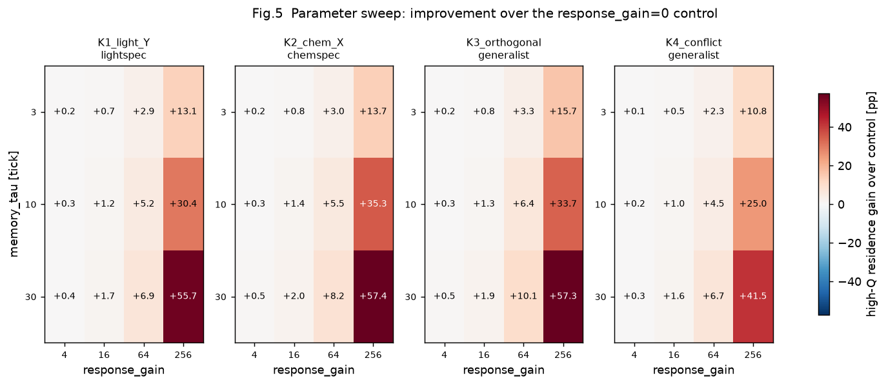
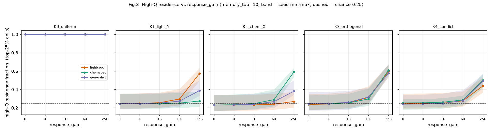
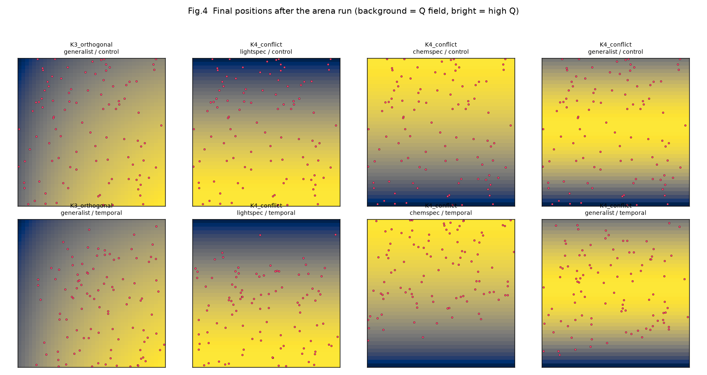

# Exp10 中間報告 — Phase A完了（Green）と Phase B の前提崩れ

更新: 2026-08-31
状態: **Phase A完了 / Phase B は前提の再検討が必要。人間判断待ち**

正本:
- 条件・判定: `docs/Exp10_実験計画案.md`
- モデル: `docs/V1.6_行動則設計案.md`
- 実測: `experiments/exp10_phaseA_20260831/NOTES.md`
- 手順: `docs/Exp10_実行手順.md`

本書は計画 §11 の

> 実装上どうしても成立しない条件が判明した場合は、実験を走らせる前に理由を
> 文書化し、人間判断を求める。

に従って書いている。**Phase B本番の条件を独断で変更していない。**

---

## 1. ここまでにやったこと

1. V1.6 を仕様どおり実装（commit `e15ee67`）
2. CI結果不変性の基準refを V1.6 実装commitへ移行（`64134ba`）
3. Phase 0（計画 §3 の15項目）を32件のテストとして実装し全通過
4. Phase A（3,900 run）を実行 → **Green**、事前登録規則で `tau=10` / `gain=64` を選定
5. Phase B本番（200 run）に着手 → **計算量の前提が実測で崩れたため停止**

## 2. Phase A — Green

詳細は `experiments/exp10_phaseA_20260831/NOTES.md`。

12組中5組がGreen、条件5（隣接する複数組で成立）もOK。
先頭10 seedだけで評価しても同じ5組がGreenで、判定はseed数に頑健だった。

§4.7（最小 `response_gain` → 同gainなら最短 `memory_tau`）が機械的に選んだ結果:

```text
memory_tau    = 10
response_gain = 64
```



事前登録の閾値 +5 pp が選別として機能している。K1/lightspec では
gain=16 が +1.2 pp で落ち、gain=64 が **+5.2 pp** でぎりぎり通過する。



### 偽biasが「厳密に」無いこと

K0（一様刺激）の drift は **gain によらず完全に同一**（x = −0.06 / y = −0.01）。
一様場では `dQ` が恒等的に0になり `turn_factor = 1` のままなので、
統計的にではなく厳密に一致する（Welch t = 0）。

### 複数刺激の統合

K3（直交）で generalist が両軸へ同時に偏った（drift_x = +3.79 / drift_y = +3.07 cell）。
K4（逆向き）では lightspec が +4.29、chemspec が −5.22 と期待どおり反対方向へ分かれ、
generalist は中間（−0.75）に留まった。



---

## 3. Phase B で崩れた前提 — 計算量

計画 §7 は

> Exp09実績（5,000 tick run 約2.2 core-min）から、Phase Bは十分現実的な規模

としているが、**この前提はV1.6では成り立たない**ことが実測で分かった。

### 実測（b1_light_only_lightspec_control, seed1）

Matterは全期間 **3280.00 で厳密に保存**されており、バグではない。

| tick | population | mean_body_size | 光利用率 |
|---:|---:|---:|---:|
| 20 | 196 | 0.996 | – |
| 1,620 | 867 | 0.941 | – |
| 4,020 | 1,670 | 0.681 | – |
| 6,420 | 4,878 | 0.297 | – |
| 8,080 | 6,511 | 0.226 | **65.5%** |

- **個体数が V1.5 の約300から約6,500へ、20倍以上**
- 光の利用率が **11.7%（Exp09 / V1.5）→ 65.5%（V1.6）**
- `mean_body_size` が 0.996 → 0.226 へ縮小

### なぜこうなるか

V1.5では `sensory_range` が `cell_size` を下回るため個体が事実上固着しており、
子は親の近くに置かれて同じセルの光を奪い合っていた（Exp09で移動量ゼロ）。

V1.6で動けるようになった結果、集団が光場全体へ広がって競合が緩み、
**世界の光をはるかに多く使えるようになった**。Matterは保存されているので、
増えた分は身体の小型化（同じMatter量でより多くの個体）として現れている。

小型化そのものは AGENTS.md「小型化の判断」が V1.4 の自然な選択圧として
既に許容を決めた現象で、V1.6 はそれを増幅した形になる。

### 計算量への影響

個体数20倍のため 1 run が **約40分**（10,000 tick）になり、

```text
Phase B 200 run = 約127 core-hour
  ローカル4並列  : 約31時間
  Actions 20並列 : 約7時間
```

計画 §7 の見積もり（Exp09基準）から**約18倍**ずれている。

---

## 4. Phase B を Actions で回せない技術的事情

`workflow_dispatch` は workflow ファイルが **default branch に存在しないと起動できない**。
`.github/workflows/exp10.yml` は現在 `claude/pilot-execution-plan-52spjd` に
しかないため、API から起動すると 404 が返る（実際に確認済み）。

ローカル実行用に `tools/run_exp10_phaseB.py` を用意してある
（workflowと同じ条件・同じ停止条件を同じ順で回す）が、
ローカルではDriveへの生データ転送ができない（rclone設定はGitHub secret）。

---

## 5. b2 chemical-only の暫定観測（**確定値ではない**）

Phase Bを止める前に、§5.5 の重要停止条件に直結する b2 だけ先に走らせた。
chemical-only は個体数が小さく（15〜134）runが速いため、ここまで進んでいる。

**treatment は 20 seed中12しか走っておらず、§5.5 の判定には使えない。**
以下はあくまで途中経過である。

| | control (gain=0) | treatment (gain=64) |
|---|---|---|
| 10,000 tick完走 | 18 / 20 | 8 / 12（残り8 seed未実行） |
| 絶滅 | **2 seed**（s2 が tick 5,409、s6 が 5,394 で pop=0） | 0 |
| 完走runの最終pop | 中央値 52（15〜134） | 中央値 106（82〜117） |
| vent滞在率（全期間平均） | 0.782 | 0.846 |
| 平均移動量 [wu/tick] | 0.575 | 0.692 |

生データの要約は `experiments/exp10_phaseB_partial_20260831/phaseB_b2_partial.csv`。

### 暫定的に言えそうなこと

`docs/V1.6_Exp10_レビュー.md` B-4 で私が挙げた懸念は

> V1.6は定位保持を失うため、vent滞在に依存する chemical-only 生態が
> 壊れないかが最大の懸念

だったが、**途中経過は逆を示している**。temporal sensing 側の方が
vent滞在率が高く（0.846 vs 0.782）、個体数のばらつきも小さく、絶滅が出ていない。
曲がり幅の変調が、pure random walk より vent 近傍に留まらせている可能性がある。

ただし **treatment が 12 seed しか無いので、これを結論にしてはいけない。**
§5.5 の「20 seed中18以上」の判定には残り8 seedの実行が必要である。

---

## 6. 判明した計測上の問題 — high-Q領域滞在率の退化

`hi_q_frac` は「その表現型の `Q` が上位25%のセル」に居た割合で定義した。
しかし **Qの最小値を25%を超えるセルが共有する環境では退化して常に1.0になる。**

- **K0（一様刺激）**: `Q` が空間一定 → 閾値＝定数 → 全セルがhigh-Q
- **b2（chemical-only）**: 光0なので `Q` は chemical のみで決まり、
  vent以外（96.75%のセル）が `Q=0` → 上位25%の閾値が0 → 全セルがhigh-Q

そのため計画 §8-3

> 単一刺激gradientでrandomより高Q領域へ有意な偏り

は、**b2 では現在の指標で評価できない**。b2 では `vent_cell_frac`
（control 0.782 / treatment 0.846）が意味のある空間指標になる。

K0 のGreen条件は drift で見ているのでPhase Aの判定には影響していない。

これも結果を見てから指標を作り替えるのは避けるべきなので、
**扱いを人間判断で決めていただきたい。**

---

## 7. 要判断項目

### 7.1 Phase B本番の回し方

| 案 | 内容 | 実行時間 | 事前登録との関係 |
|---|---|---|---|
| A | `exp10.yml` を main へ入れて Actions で回す | 約7時間 | 規模を一切変えない |
| B | b2 だけローカルで完走させ、light系は保留 | 約20分 | §5.5 のみ確定。他は未了 |
| C | ローカルで tick を 5,000 へ縮小して200 run | 約8時間 | **§11 に抵触**（結果を見た後の条件変更） |

案Aが事前登録を守れる唯一の方法だが、`exp10.yml` を main へ入れる必要がある。
PRの作成はご指示をいただいてから行う。

### 7.2 個体数20倍・小型化の扱い

Phase B の `fixed_genes` は `light_absorption` / `chemical_absorption` の2つだけで、
`body_size` は自由に進化する。計画 §5.2 の「進化はOFF」という記述と実際はずれている
（Exp09も同じ設定だったが、固着していたため body_size がほぼ動かなかった）。

control / treatment 双方が同じ小型化を受けるので対照比較自体は成立するが、
10,000 tick では**行動則より体サイズ進化の方が支配的**になる。

- 案1: 仕様どおりの結果として記録する（AGENTS.md の小型化許容方針に沿う）
- 案2: Phase B で `body_size` も固定し、行動則だけを見る
  （事前登録後に `fixed_genes` を変えることになる）

### 7.3 high-Q領域滞在率の退化（§6）

- 案1: b2 では `vent_cell_frac` で §8-3 を判定すると明記する
- 案2: high-Q の定義を「Qが最大値の上位25%**かつ** Q>0」等へ改める
  （事前登録後の指標変更になる）
- 案3: b2 は §8-3 の判定対象から外し、§5.5（生存）のみで判断する

---

## 8. 現時点で確定していること

- V1.6 の実装は仕様どおりで、Phase 0 の15項目すべてを通っている
- Phase A は事前登録どおり Green で、`tau=10` / `gain=64` が機械的に選ばれた
- Matter保存・Energy台帳・seed決定論はV1.6でも成立している
- 一様刺激で偽biasが厳密に出ないことが実測で確認できた

## 9. 確定していないこと

- Phase B（生態を壊さないか）の全条件
- §5.5 chemical-only の生存判定（treatment 12/20 seed のみ）
- Phase C（長時間頑健性）
- V1.6 を default 化してよいか
