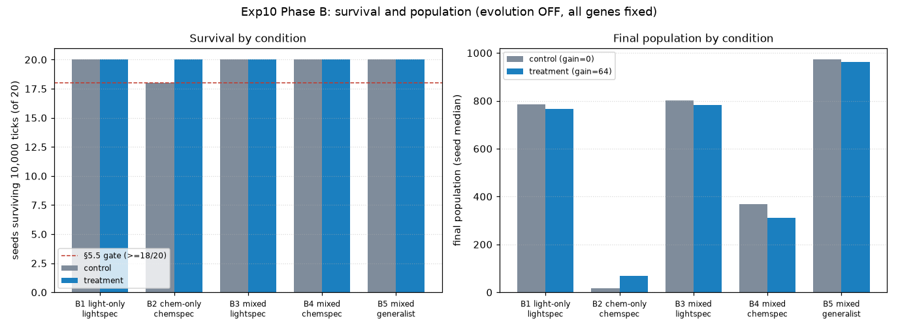
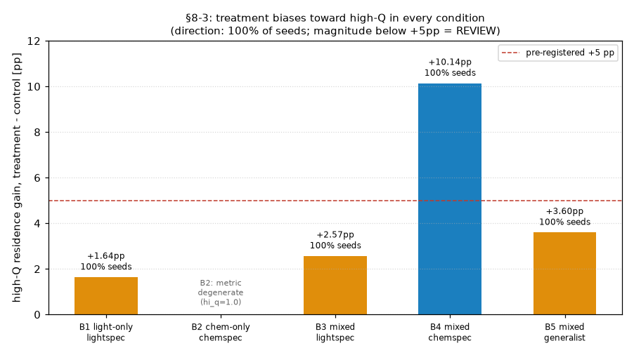
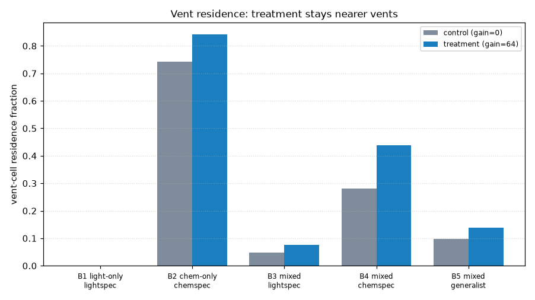
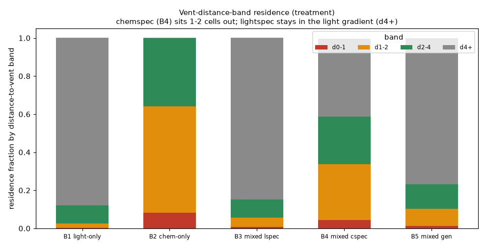
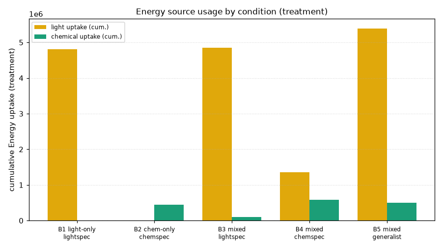
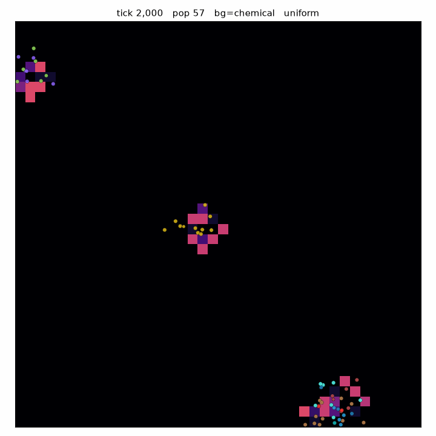
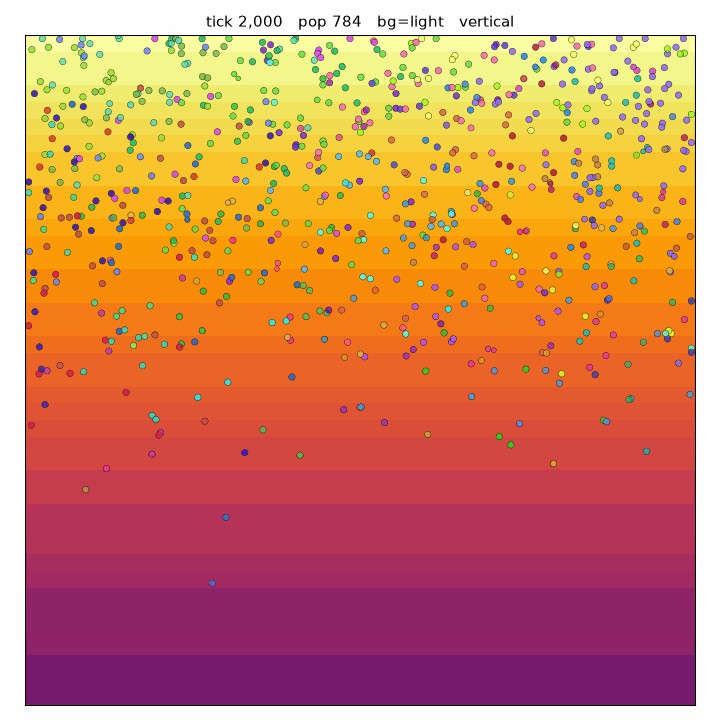

# Exp10 Phase B 結果考察 — V1.6 temporal biased random walk の生態検証

更新: 2026-09-01
状態: **正式 Phase B 完了 / Green（§5.5 クリア・全整合性 OK）**

正本:
- 条件・判定: `docs/Exp10_実験計画案.md`
- モデル: `docs/V1.6_行動則設計案.md`
- 再トライアル方針: Issue #41「Exp10 Phase B 正式再トライアル方針」
- 実測 NOTES: `experiments/exp10_phaseB_20260901/NOTES.md`

---

## 1. 目的

V1.6（現在地で感じる一次Energy刺激の時間変化 `dQ` で random walk の曲がり幅
だけを変える temporal biased random walk）が、**生態を壊さずに機能するか**を
標準混合世界で確認する。行動則の局所的な正しさは Phase A（軽量 arena）が
担当済み。**進化的優劣はここでは結論しない**（進化OFF・診断表現型固定）。

`dQ` から「どちらへ行くか」は求めない。向きは常に random walk のままで、
`sigma_eff = wander_turn_sigma * 2/(1+exp(gain*dQ))` により曲がり幅のみ変調する。

## 2. 条件

5条件 × control/treatment × seed 1-20 × 10,000 tick = **200 run**。

| 条件 | 光 | chemical | 表現型 (light/chem 吸収) |
|---|---|---|---|
| B1 light-only | vertical gradient | なし | lightspec 2.0 / 0.3 |
| B2 chem-only | 暗 | vent flux 16 | chemspec 0.3 / 2.0 |
| B3 mixed | vertical | vent flux 16 | lightspec 2.0 / 0.3 |
| B4 mixed | vertical | vent flux 16 | chemspec 0.3 / 2.0 |
| B5 mixed | vertical | vent flux 16 | generalist 1.0 / 1.0 |

- **control**: `response_gain = 0`（pure random walk）
- **treatment**: `response_gain = 64`, `memory_tau = 10`（Phase A で事前登録規則により選定）
- `memory_tau` は control / treatment 同一。行動則の軸だけを振る。
- **進化OFF**: 全14遺伝子を固定（Issue #41 再トライアル方針）。表現型2遺伝子だけ
  事前登録値に上書きし、残りは `INITIAL_GENOME` 据え置き。

### 2.1 再トライアルの経緯（重要）

初回 Phase B は「進化OFF」の意図に反し、`light_absorption` / `chemical_absorption`
の2遺伝子しか固定しておらず、`body_size` 等12遺伝子が自由進化していた（実装漏れ）。
その結果 `body_size` が縮小し個体数が約20倍（〜6,500）に膨れていた。本結果は
**全14遺伝子を固定して当初事前登録どおりに戻した正式再実行**である。`body_size`
は全条件・全 run で 1.0 固定、個体数は Exp09 相当（〜300〜1,000）に戻った。

## 3. 健全性・整合性チェック（すべて OK）

全 200 run が **同一 commit `287dc9b8` / 同一数値実行環境
`linux-x86_64-glibc2.39-py3.12.3-np2.5.2`** で実行された。

- **進化OFF の機械的検証**: 全条件で `body_size=1.0` / `mutation_rate=0.05`、
  14遺伝子すべてが全個体・全期間で分散0（`check_exp10.py`、条件チェック計 数千項目 OK）。
- **source 排他**: light-only は累積 chemical flow=0、chemical-only は光供給0、
  mixed は両方>0。
- **§8-7（供給側の物理）**: 全 mixed/light 条件で control と treatment の
  light 供給が厳密一致（12,480,000）。吸収・Energy/Matter 物理は行動則で壊れていない。
- 全 workflow が **整合性 OK で success**（環境不一致・run不足・固定表現型違反・
  物理破壊のいずれも無し）。生データは Google Drive と Actions artifact
  `exp10-summary` へ転送済み。

絶滅は「実行の失敗」ではなく測定結果として扱う（B2 control で2 seed が絶滅）。

## 4. 主結果（seed 中央値、20 seed / 条件）

| 条件 / 行動則 | 生存 | 最終pop | hi_q | vent滞在 | 平均移動 | 光取得(累積) | chem取得(累積) |
|---|---:|---:|---:|---:|---:|---:|---:|
| B1 lightspec / control | 20/20 | 784 | 0.591 | 0.000 | 0.782 | 4,897,943 | 0 |
| B1 lightspec / treatment | 20/20 | 766 | 0.607 | 0.000 | 0.782 | 4,813,445 | 0 |
| B2 chemspec / control | **18/20** | 16 | 1.000 | 0.742 | 0.696 | 0 | 155,395 |
| B2 chemspec / treatment | **20/20** | 68 | 1.000 | 0.842 | 0.753 | 0 | 446,536 |
| B3 mixed lightspec / control | 20/20 | 803 | 0.606 | 0.048 | 0.782 | 4,988,937 | 60,841 |
| B3 mixed lightspec / treatment | 20/20 | 782 | 0.627 | 0.077 | 0.781 | 4,850,160 | 97,767 |
| B4 mixed chemspec / control | 20/20 | 368 | 0.595 | 0.280 | 0.776 | 1,754,743 | 529,872 |
| B4 mixed chemspec / treatment | 20/20 | 310 | 0.687 | 0.439 | 0.792 | 1,353,339 | 585,151 |
| B5 mixed generalist / control | 20/20 | 972 | 0.594 | 0.098 | 0.778 | 5,566,968 | 368,515 |
| B5 mixed generalist / treatment | 20/20 | 962 | 0.624 | 0.139 | 0.783 | 5,388,469 | 494,822 |

### 4.1 重要停止条件 §5.5 — **クリア**

> B2 chemical-only の treatment で 20 seed中18以上が 10,000 tick まで生存すること。

**treatment は 20/20 生存でクリア**（control は 18/20、seed 7・19 が絶滅）。
V1.6 は定位保持（現在セルが最良なら停止）を廃止するため、vent 滞在に依存する
chemical-only 生態が壊れないかが最大の懸念だった（レビュー B-4）。実測は逆で、
temporal sensing 側の方が **絶滅ゼロ・個体数 約4倍（68 vs 16）・vent 滞在率が高い
（0.842 vs 0.742）・chemical 取得 約2.9倍**。曲がり幅の変調が、pure random walk
より vent 近傍に留まらせている。

### 4.2 §8-3 — treatment は全条件で high-Q 領域へ偏る（方向は100%、magnitudeは条件依存）

treatment の high-Q 滞在率改善は **全条件で 20/20 seed が改善（方向は常に正しい）**。
改善量中央値は B1 +1.64pp / B3 +2.57pp / B5 +3.60pp / **B4 +10.14pp**。事前登録の
+5pp 閾値を超えたのは B4（mixed chemspec）のみで、他は REVIEW 扱い。B4 で最大に
なるのは、vent 周りの chemical stock 勾配が急で `dQ` が大きく振れるためで、
光が支配的な条件では `dQ` が小さく改善量も小さい（Fig.5・レビュー B-2 と整合）。
B2 は `hi_q` が定義上 control/treatment とも 1.0 固定になる指標退化（§6）のため、
改善量は評価対象外（vent 滞在率で見ると 0.742→0.842）。

### 4.3 §8-4 — generalist は両刺激を統合する — OK

B5 treatment で `dQ_light` と `dQ_chem` がともに非ゼロの seed が **20/20 → OK**。
能力加重平均 `Q=(aL*R_light+aC*R_chem)/(aL+aC)` により、generalist は光と chemical
の両方から曲がり幅の変調を受ける。

### 4.4 vent 滞在と距離帯別の空間構造

vent を持つ全条件で treatment の vent 滞在率が control を上回る
（B2 0.742→0.842 / B3 0.048→0.077 / B4 0.280→0.439 / B5 0.098→0.139）。
chemical 取得も対応して増える。

距離帯別（treatment）では表現型で明確に分かれる。**chemspec（B4）は vent の
1〜2セル外側（d1-2 が最大 0.294）に集まり**、vent 直上（d0-1 0.044）より外に
留まる。これは直上では stock を吸い尽くして `dQ` が下がるためで、消費→離脱→
stock 回復→再誘引という stock 型資源の性質と整合する。**lightspec（B1/B3）は
vent から遠い明部の光勾配側（d4+ が 0.85〜0.88）**に留まり、generalist（B5）は
その中間（d4+ 0.77）。

### 4.5 代表空間 GIF

chemical-only（B2、vent 近傍に集まる）と light-only（B1、明部の光勾配側に広がる）。

## 5. 何を結論できるか

- **§5.5（生態の非破壊）をクリア**した。V1.6 の temporal biased random walk は
  vent 依存の chemical-only 生態を壊さず、むしろ強化する。
- treatment は**全条件で high-Q 領域へ偏り**（方向は 20/20 seed）、generalist は
  **両刺激を統合**し、供給側の物理は壊れていない。
- 進化OFF が機械的に確認され、初回 Phase B の個体数20倍・小型化は再現しない。
- Phase 0（15項目）・Phase A（Green）と合わせ、**V1.6 は事前登録した Phase B の
  条件を満たした（Green）**。

## 6. 何を結論できないか（Exp10 §9 / レビュー）

- **light vs chemical の進化的優劣・専門化方向**：進化OFF・表現型固定なので
  評価対象外。
- **§8-3 の +5pp 未達（B1/B3/B5）**：方向は全 seed で正しいが magnitude が小さい。
  光支配条件で `dQ` が小さいことに由来する設計どおりの挙動であり、閾値未達を
  「効かない」とは読まない。閾値の扱いは要人間判断（REVIEW）。
- **high-Q 指標の退化（§6 相当）**：B2（および一様場）では `hi_q` が 1.0 固定に
  なり §8-3 を測れない。指標定義の改訂は結果を見てからは行わず、判断項目として残す。
- **Phase C（長時間頑健性・tick 延長）**：未実施。Phase A/B が Green のときのみ
  実施の位置づけ（計画 §6）。

## 7. 次の判断

1. §8-3 の +5pp 閾値を単一刺激（B1/B2）以外にどう適用するか（REVIEW 項目）。
2. high-Q 指標退化（B2・一様場）の扱い（`vent_cell_frac` で代替と明記するか、
   指標を `Q>0` かつ上位25% へ改めるか）。
3. Phase C を実施するか、V1.6 を default 化してよいか。

いずれも絶対原則9（原則1軸ずつ）に従い、**結果を見てその場で条件・指標を
変更していない**。
